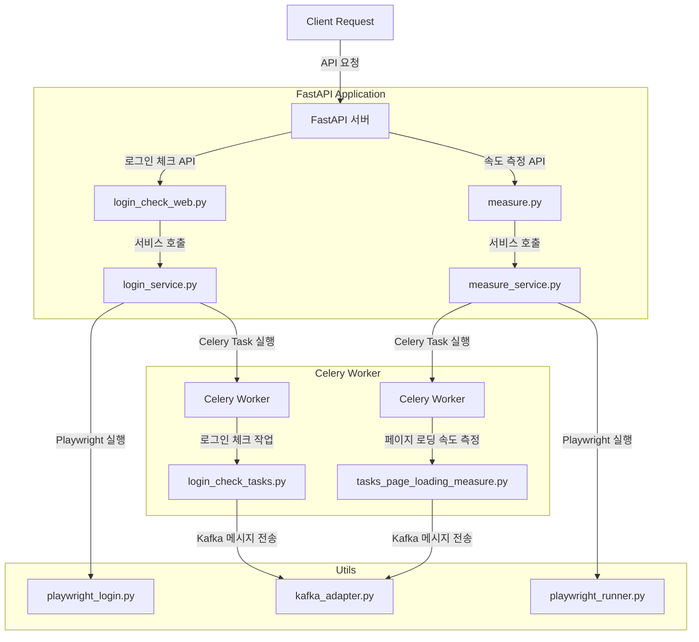
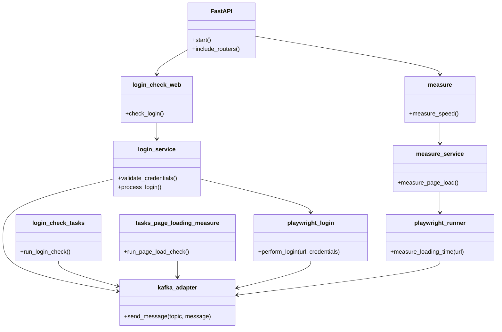
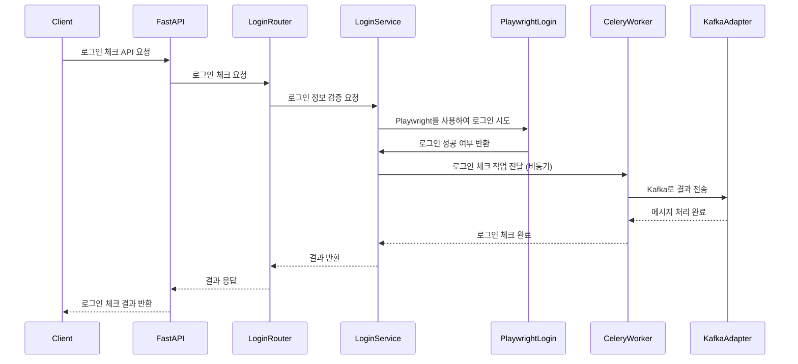

# WASP
> FastAPI 기반 웹 페이지 성능 및 로그인 체크 애플리케이션

## 애플리케이션 설명
이 프로젝트는 웹 페이지의 속도를 측정하고, 특정 웹 페이지에 대한 로그인 여부를 테스트하기 위해 `FastAPI`를 기반으로 구축되었습니다. `Playwright` 라이브러리를 활용하여 웹 페이지 로딩 시간 측정 및 로그인 검증을 자동화하며, 결과 데이터를 `Kafka`로 `xAPI 형태`로 전송을하고 `Kibana`를 통하여 모니터링을 하게 됩니다.

## 주요 기능
1. **웹 페이지 속도 측정**
   - URL 리스트를 입력받아 각 페이지의 로딩 시간을 측정.
   - 측정된 결과를 Kafka로 전송.

2. **웹 페이지 로그인 체크**
   - 로그인 정보(ID, 비밀번호)를 활용하여 웹 페이지 로그인 성공 여부 확인.
   - 로그인 결과를 Kafka로 전송.

3. **Swagger UI 제공**
   - `/docs` 경로를 통해 API 명세 확인 가능.

## 기술 스택
- **프레임워크**: FastAPI
- **웹 자동화 도구**: Playwright
- **메시지 큐**: Kafka
- **비동기 작업 큐**: Celery
- **메모리 DB**: Redis
- **로깅**: Python `logging` 모듈
- **Python 버전**: 3.9 이상
- **컨테이너화**: Docker

## 프로젝트 구조
```bash
app/ 
├── Dockerfile              # FastAPI 애플리케이션 Docker 빌드 파일
├── Dockerfile.celery       # Celery 워커 Docker 빌드 파일
├── README.md               # 프로젝트 설명 문서
├── app                     # 애플리케이션 코드
│   ├── celeryconfig.py     # Celery 설정 파일
│   ├── docker-compose.yml  # Docker Compose 설정 파일 (여러 컨테이너 관리)
│   ├── main.py             # FastAPI 애플리케이션 엔트리포인트
│   ├── models              # 데이터 모델 정의
│   │   └── schemas.py      # Pydantic 데이터 모델 정의 (API 요청/응답 스키마)
│   ├── routes              # API 라우터 정의
│   │   ├── celery_task.py   # Celery 작업 실행을 위한 라우터
│   │   ├── login_check_web.py # 웹 로그인 체크 API 라우터
│   │   ├── measure.py         # 속도 측정 API 라우터
│   │   ├── tasks_login_check.py # 로그인 체크 Celery 작업 트리거 라우터
│   │   └── tasks_page_loading_measure.py # 페이지 로딩 측정 Celery 작업 트리거 라우터
│   ├── services              # 비즈니스 로직 처리 서비스
│   │   ├── login_service.py  # 로그인 처리 서비스 로직
│   │   └── measure_service.py # 속도 측정 처리 서비스 로직
│   ├── tasks                 # Celery 작업 정의
│   │   ├── __init__.py       # tasks 패키지 초기화
│   │   ├── login_check_tasks.py # 로그인 체크 Celery 작업 정의
│   │   └── tasks_page_loading_measure.py # 페이지 로딩 측정 Celery 작업 정의
│   └── utils                # 유틸리티 함수 및 클래스
│       ├── error_handler.py  # 예외 처리 유틸리티
│       ├── kafka_adapter.py  # Kafka 메시지 전송 유틸리티
│       ├── playwright_login.py # Playwright 기반 로그인 처리 유틸리티
│       ├── playwright_runner.py # Playwright 기반 속도 측정 유틸리티
│       └── singleton_meta.py # Singleton 패턴 구현 메타클래스
├── requirements.txt      # Python 의존성 목록
├── test_main.http        # HTTP 클라이언트 테스트 파일 (예: IntelliJ HTTP Client)
└── wasp-playwright.iml   # IntelliJ IDEA 프로젝트 파일
```

## 다이어그램

### 1. 프로세스 다이어그램


### 2. 클래스 다이어그램

### 3. 시퀀스 다이어그램


## 설치 및 실행방법
### 1. 의존성 설치
```bash
pip install -r requirements.txt
```

### 2. FastAPI 서버 실행
필요하다면 --workers 옵션을 통해 워커 수를 조절할 수 있습니다.
```bash
uvicorn app.main:app --reload --host 0.0.0.0 --port 8082
```

### 3. Swagger UI
FastAPI는 기본적으로 Swagger UI를 제공합니다.
- Swagger UI : http://localhost:8082/docs

## Docker로 실행하기
### 1. Docker 이미지 빌드
아래는 프로젝트를 위한 Dockerfile 입니다.
```Dockerfile
# Base image
FROM python:3.11-slim

# Install system dependencies
RUN apt-get update && apt-get install -y --no-install-recommends \
    libnss3 libatk1.0-0 libatk-bridge2.0-0 libcups2 libx11-xcb1 \
    libxcomposite1 libxdamage1 libxrandr2 libgbm1 libasound2 \
    libpangocairo-1.0-0 libxshmfence1 libgtk-3-0 ca-certificates \
    && apt-get clean && rm -rf /var/lib/apt/lists/*

# Install Python dependencies
WORKDIR /app
COPY requirements.txt .
RUN pip install --no-cache-dir --upgrade pip && pip install --no-cache-dir -r requirements.txt

# Install Playwright and browsers
RUN pip install playwright && playwright install --with-deps

# 도커 빌드 시 전달할 ARG 설정 (기본값 dev)
ARG ENV=dev
ARG ENV_PATH=docker
ARG KAFKA_URL

# 환경변수 컨테이너내에 설정
ENV ENV=${ENV}
ENV KAFKA_MONITORING_URL=${KAFKA_URL}
ENV ENV_PATH=${ENV_PATH}

COPY . .

# Expose port
EXPOSE 8080

# Run the FastAPI application using Uvicorn
CMD ["uvicorn", "app.main:app", "--host", "0.0.0.0", "--port", "8080"]
```
**Celery** 워커를 위한 Dockerfile은 아래와 같습니다.
```Dockerfile
# Python 3.11 slim 이미지를 사용
FROM python:3.11-slim

# 작업 디렉토리 설정
WORKDIR /app

# 의존성 파일 복사 및 설치
COPY requirements.txt .
RUN pip install --no-cache-dir -r requirements.txt

ENV REDIS_URL=${REDIS_URL}

# Celery 애플리케이션 복사
COPY . .

# Celery worker 실행
CMD ["celery", "-A", "app.celeryconfig.celery_app", "worker", "--loglevel=info", "-c", "2"]
```


### 2. 도커 이미지 빌드
**dev** 환경에서 아래 명령어를 사용해 Docker 이미지를 빌드합니다.
```bash
docker build -t wasp:dev .
# 환경변수
docker build -t wasp:dev --build-arg ENV=dev --build-arg KAFKA_URL=kafka:9092 .
```
**celery worker** 를 위한 이미지 빌드
```bash
docker build -f Dockerfile.celery -t wasp-celery:dev .
```
### 3. 도커 컨테이너 실행
```bash
docker run -d -p 8080:8080 wasp:dev
# 환경변수
docker run -d -p 8080:8080 --env KAFKA_URL=kafka:9092 wasp:dev
```
**celery worker** 실행
```bash
docker run -d --env REDIS_URL=redis://localhost:6379 wasp-celery:dev
```

### 4. Swagger UI
- Swagger UI : http://localhost:8080/docs
- Redoc : http://localhost:8080/redoc

## 프로젝트 기여자
- [SeungYeon Lee](sylee2@lezhin.com)
- [HyunJoon Noh](jun1@lezhin.com)